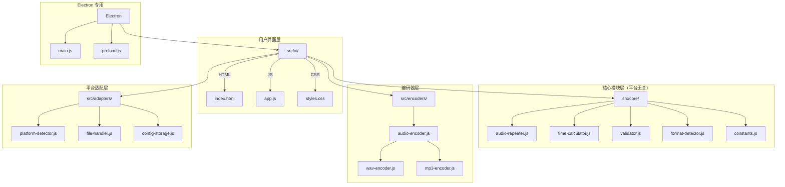

# 打卡剪辑助手 - 开发者指南

## 目录

1. [项目概述](#项目概述)
2. [架构设计](#架构设计)
3. [核心模块说明](#核心模块说明)
4. [平台适配层](#平台适配层)
5. [音频编码器](#音频编码器)
6. [构建系统](#构建系统)
7. [IPC 通信（Electron）](#ipc-通信electron)
8. [编码规范](#编码规范)
9. [测试](#测试)
10. [未来展望](#未来展望)

## 1. 项目概述

打卡剪辑助手是一个跨平台音频处理应用，同时支持 **Electron 桌面版**和 **Web 浏览器版**。v2.0 版本采用统一架构设计，Electron 和 Web 版本共享同一套核心代码和 UI 组件。

### 核心功能
- 音频文件重复拼接到指定时长
- 随机延长功能（0 到指定秒数之间随机）
- 支持 WAV 和 MP3 两种输出格式
- 支持多种输入格式（MP3、WAV、FLAC、M4A、OGG 等）

## 2. 架构设计

### 2.1 统一架构图



### 2.2 目录结构

```
src/
├── core/                   # 核心模块（平台无关）
│   ├── audio-repeater.js   # 音频重复拼接逻辑
│   ├── time-calculator.js  # 时间计算工具
│   ├── validator.js        # 输入验证
│   ├── format-detector.js  # 格式检测
│   └── constants.js        # 常量定义
├── encoders/               # 音频编码器
│   ├── audio-encoder.js    # 编码器统一接口
│   ├── wav-encoder.js      # WAV 编码器
│   └── mp3-encoder.js      # MP3 编码器 (lamejs)
├── adapters/               # 平台适配层
│   ├── platform-detector.js # 平台检测
│   ├── file-handler.js     # 文件处理适配器
│   └── config-storage.js   # 配置存储适配器
├── ui/                     # 统一 UI
│   ├── index.html
│   ├── app.js
│   └── styles.css
└── renderer/               # Electron 专用
    └── preload.js
```

### 2.3 设计原则

1. **核心模块平台无关**：`src/core/` 下的模块不依赖任何平台特定 API
2. **适配器模式**：通过 `src/adapters/` 抽象平台差异
3. **单例模式**：`getFileHandler()` 和 `getConfigStorage()` 返回全局唯一实例
4. **ES6 模块化**：使用 `import/export` 实现跨平台代码共享

## 3. 核心模块说明

### 3.1 audio-repeater.js

音频重复拼接的核心逻辑。

```javascript
import { AudioRepeater } from '../core/audio-repeater.js';

// 使用示例
const resultBuffer = await AudioRepeater.repeatAudio(
  sourceBuffer,      // AudioBuffer - 源音频
  targetDuration,    // number - 目标时长（秒）
  audioContext,      // AudioContext - Web Audio 上下文
  (progress) => {    // 进度回调
    console.log(`进度: ${progress}%`);
  }
);
```

**主要方法**：
- `repeatAudio(sourceBuffer, targetDuration, audioContext, progressCallback)` - 将音频重复到目标时长

### 3.2 time-calculator.js

时间计算和格式化工具。

```javascript
import { TimeCalculator } from '../core/time-calculator.js';

// 格式化时长
TimeCalculator.formatDuration(125);        // "2:05"
TimeCalculator.formatDurationVerbose(125); // "2分5秒"

// 计算扩展时长（随机延长）
const extended = TimeCalculator.calculateExtendedDuration(600, 60);
// 返回 600 到 660 之间的随机值
```

**主要方法**：
- `formatDuration(totalSeconds)` - 返回 `"M:SS"` 格式
- `formatDurationVerbose(totalSeconds)` - 返回 `"X分X秒"` 格式
- `calculateExtendedDuration(baseDuration, maxExtendSeconds)` - 随机延长

### 3.3 validator.js

输入验证工具。

```javascript
import { Validator } from '../core/validator.js';

// 验证文件
const fileResult = Validator.validateFile(file);
// { valid: true } 或 { valid: false, error: "错误信息" }

// 验证音频缓冲区
const bufferResult = Validator.validateAudioBuffer(buffer);

// 验证目标时长
const durationResult = Validator.validateTargetDuration(10, 30);
// { valid: true, message: "10分30秒", duration: 630 }
```

### 3.4 constants.js

应用常量定义。

```javascript
import { AUDIO_CONSTANTS, UI_CONSTANTS } from '../core/constants.js';

// 音频相关常量
AUDIO_CONSTANTS.SUPPORTED_FORMATS  // ['mp3', 'wav', 'flac', ...]
AUDIO_CONSTANTS.MAX_FILE_SIZE      // 最大文件大小
AUDIO_CONSTANTS.MP3_BITRATE        // MP3 比特率 (192)

// UI 相关常量
UI_CONSTANTS.DEFAULT_MINUTES       // 默认分钟数 (10)
UI_CONSTANTS.DEFAULT_EXTEND_SECONDS // 默认延长秒数 (60)
```

## 4. 平台适配层

### 4.1 platform-detector.js

检测当前运行环境。

```javascript
import { PlatformDetector } from '../adapters/platform-detector.js';

PlatformDetector.isElectron();  // true/false
PlatformDetector.isWeb();       // true/false
PlatformDetector.getPlatform(); // 'electron' 或 'web'

// 检查功能支持
PlatformDetector.hasFeature('fs');           // 文件系统
PlatformDetector.hasFeature('localStorage'); // 本地存储
PlatformDetector.hasFeature('audioContext'); // Web Audio API
```

### 4.2 file-handler.js

文件处理适配器，为不同平台提供统一的文件操作接口。

```javascript
import { getFileHandler } from '../adapters/file-handler.js';

const fileHandler = getFileHandler();

// 保存音频文件
await fileHandler.saveAudioFile(blob, filename);
// - Electron: 打开保存对话框，写入文件系统
// - Web: 触发浏览器下载
```

### 4.3 config-storage.js

配置存储适配器，使用 localStorage 实现。

```javascript
import { getConfigStorage } from '../adapters/config-storage.js';

const configStorage = getConfigStorage();

// 保存配置
configStorage.set('targetMinutes', 10);
configStorage.set('outputFormat', 'wav');

// 读取配置
const minutes = configStorage.get('targetMinutes', 10); // 默认值 10

// 获取所有配置
const allConfig = configStorage.getAll();
```

## 5. 音频编码器

### 5.1 audio-encoder.js

编码器统一接口。

```javascript
import { AudioEncoder } from '../encoders/audio-encoder.js';

// 编码为 WAV
const wavBlob = await AudioEncoder.encode(audioBuffer, 'wav');

// 编码为 MP3 (192kbps)
const mp3Blob = await AudioEncoder.encode(audioBuffer, 'mp3', {
  bitRate: 192
});
```

### 5.2 wav-encoder.js

WAV 格式编码器（无损）。

```javascript
import { WavEncoder } from '../encoders/wav-encoder.js';

const wavBlob = await WavEncoder.encode(audioBuffer);
```

### 5.3 mp3-encoder.js

MP3 格式编码器，基于 lamejs 库。

```javascript
import { Mp3Encoder } from '../encoders/mp3-encoder.js';

const mp3Blob = await Mp3Encoder.encode(audioBuffer, {
  bitRate: 192  // 可选，默认 192kbps
});
```

**注意**：lamejs 库通过 CDN 加载（`index.html` 中的 `<script>` 标签）。

## 6. 构建系统

项目使用 Vite 作为构建工具。

### 6.1 构建命令

```bash
# 开发模式
yarn dev

# 构建 Web 版本（单文件 HTML）
yarn build:web

# 构建 Electron 版本
yarn build:electron

# 构建全部
yarn build
```

### 6.2 Vite 配置

**vite.config.js**（Electron）：
```javascript
export default defineConfig({
  root: 'src/ui',
  build: {
    outDir: '../../dist/electron',
    rollupOptions: {
      input: 'src/ui/index.html'
    }
  }
});
```

**vite.config.web.js**（Web 单文件）：
```javascript
import { viteSingleFile } from 'vite-plugin-singlefile';

export default defineConfig({
  plugins: [viteSingleFile()],
  root: 'src/ui',
  build: {
    outDir: '../../dist/web'
  }
});
```

### 6.3 输出文件

- **Web 版本**：`dist/web/index.html`（单个 HTML 文件，包含所有 CSS 和 JS）
- **Electron 版本**：`dist/` 目录下的安装包

## 7. IPC 通信（Electron）

### 7.1 可用通道

| 通道名 | 方向 | 用途 |
|--------|------|------|
| `select-audio-file` | 渲染 → 主 | 打开文件选择对话框 |
| `open-output-folder` | 渲染 → 主 | 在文件管理器中显示文件 |

### 7.2 preload.js 暴露的 API

```javascript
// 在渲染进程中使用
window.electronAPI.selectAudioFile();
window.electronAPI.openOutputFolder(filePath);
```

### 7.3 消息格式

**select-audio-file 响应**：
```javascript
{
  success: true,
  filePath: "C:/path/to/audio.mp3",
  fileName: "audio.mp3",
  fileSize: 1234567
}
```

## 8. 编码规范

### 8.1 JavaScript 规范

- **模块化**：使用 ES6 `import/export`
- **类名**：PascalCase（如 `AudioRepeater`）
- **方法/变量**：camelCase（如 `repeatAudio`）
- **常量**：UPPER_SNAKE_CASE（如 `MAX_FILE_SIZE`）
- **文件名**：kebab-case（如 `audio-repeater.js`）

### 8.2 注释规范

使用 JSDoc 风格注释：

```javascript
/**
 * 将音频重复到指定时长
 * @param {AudioBuffer} sourceBuffer - 源音频缓冲区
 * @param {number} targetDuration - 目标时长（秒）
 * @param {AudioContext} audioContext - Web Audio 上下文
 * @param {Function} progressCallback - 进度回调函数
 * @returns {Promise<AudioBuffer>} 处理后的音频缓冲区
 */
static async repeatAudio(sourceBuffer, targetDuration, audioContext, progressCallback) {
  // ...
}
```

### 8.3 错误处理

```javascript
try {
  const result = await someAsyncOperation();
} catch (error) {
  console.error('操作失败:', error.message);
  // 向用户显示友好的错误信息
  showError(`处理失败: ${error.message}`);
}
```

## 9. 测试

### 9.1 手动测试清单

- [ ] Web 版本在 Chrome/Firefox/Safari 中正常工作
- [ ] Electron 版本在 Windows/macOS 中正常工作
- [ ] 各种输入格式（MP3/WAV/FLAC/M4A/OGG）正确解码
- [ ] WAV 输出音质正常
- [ ] MP3 输出音质正常，文件可在各播放器播放
- [ ] 随机延长功能在 0 到指定秒数范围内正常工作
- [ ] 配置保存和恢复正常
- [ ] 文件拖拽上传正常
- [ ] 进度条显示正确

### 9.2 测试文件

项目根目录下有以下测试文件（开发用）：
- `test-core-modules.html` - 核心模块测试
- `test-adapters.html` - 适配器测试
- `test-mp3-encoder.html` - MP3 编码器测试

## 10. 未来展望

### 10.1 已实现
- ✅ 统一 Electron 和 Web 架构
- ✅ 真正的 MP3 编码（lamejs）
- ✅ 平台适配层抽象
- ✅ 单文件 HTML 构建

### 10.2 待实现
- 🔲 批量文件处理
- 🔲 音频波形预览
- 🔲 淡入淡出效果
- 🔲 自定义 MP3 比特率
- 🔲 更多输出格式（OGG、FLAC）
- 🔲 国际化（i18n）
- 🔲 自动化单元测试

---

## 附录：快速参考

### 模块导入

```javascript
// 核心模块
import { AudioRepeater } from '../core/audio-repeater.js';
import { TimeCalculator } from '../core/time-calculator.js';
import { Validator } from '../core/validator.js';
import { FormatDetector } from '../core/format-detector.js';
import { AUDIO_CONSTANTS, UI_CONSTANTS } from '../core/constants.js';

// 编码器
import { AudioEncoder } from '../encoders/audio-encoder.js';

// 适配器
import { PlatformDetector } from '../adapters/platform-detector.js';
import { getFileHandler } from '../adapters/file-handler.js';
import { getConfigStorage } from '../adapters/config-storage.js';
```

### 典型处理流程

```javascript
// 1. 加载音频文件
const arrayBuffer = await file.arrayBuffer();
const audioContext = new AudioContext();
const sourceBuffer = await audioContext.decodeAudioData(arrayBuffer);

// 2. 验证输入
const validation = Validator.validateAudioBuffer(sourceBuffer);
if (!validation.valid) {
  throw new Error(validation.error);
}

// 3. 计算目标时长
let targetDuration = minutes * 60 + seconds;
if (enableExtend) {
  targetDuration = TimeCalculator.calculateExtendedDuration(targetDuration, maxExtendSeconds);
}

// 4. 音频处理
const resultBuffer = await AudioRepeater.repeatAudio(
  sourceBuffer, targetDuration, audioContext, updateProgress
);

// 5. 编码输出
const blob = await AudioEncoder.encode(resultBuffer, format);

// 6. 保存文件
const fileHandler = getFileHandler();
await fileHandler.saveAudioFile(blob, filename);