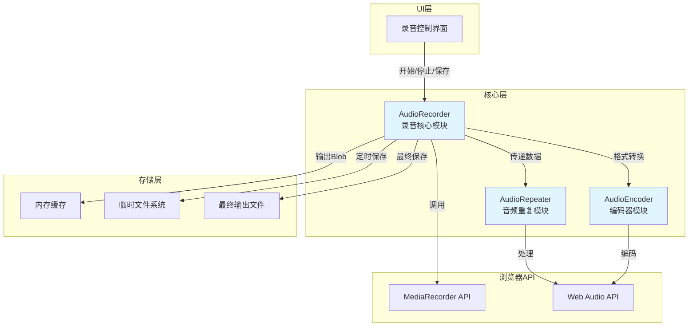
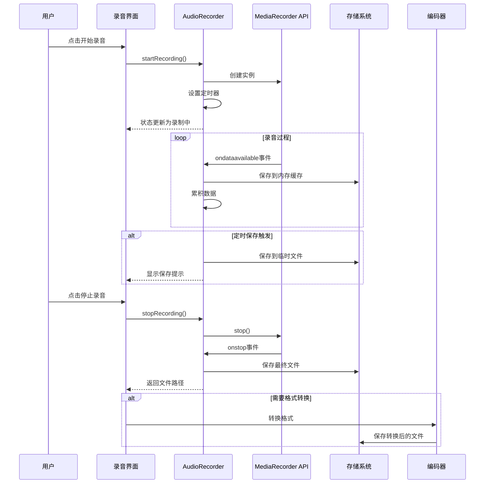
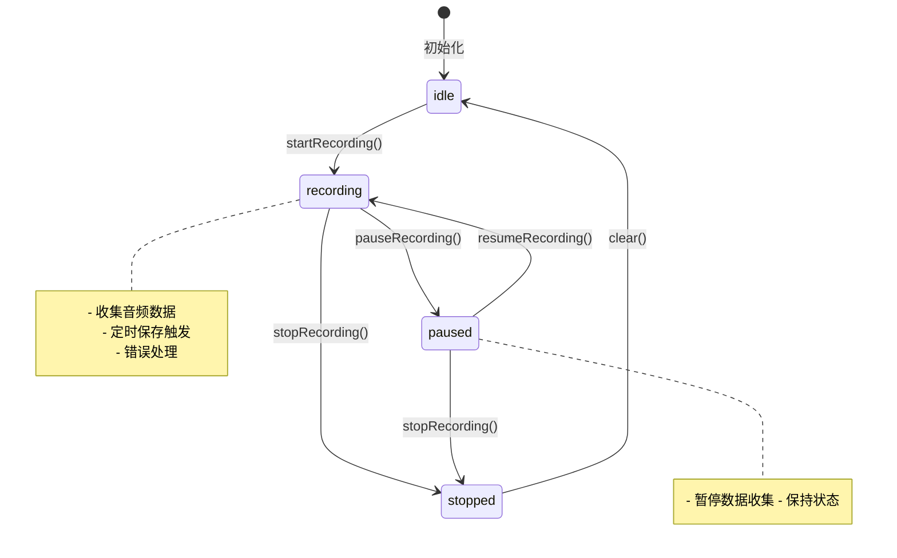
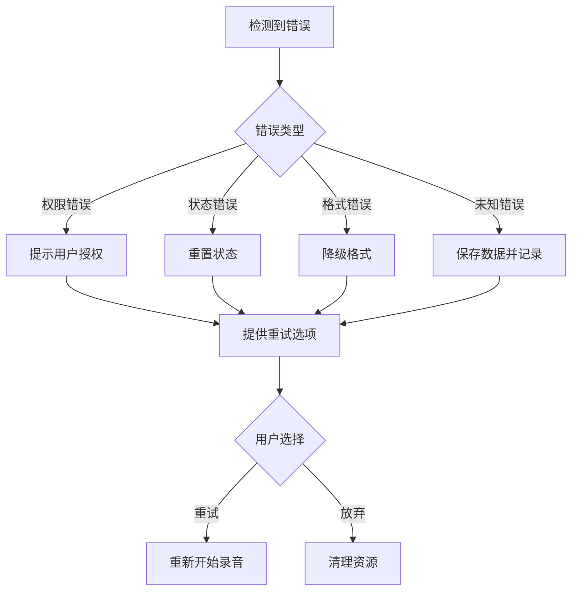

# 录音功能技术设计方案

## 一、项目背景

Daka-Helper是一个基于Electron + Vite的音频处理应用，需要集成稳定的录音功能和自动保存机制，以提供完整的音频处理能力。

**项目技术栈**：
- Electron 36.3.2
- Vite 7.3.0
- Web Audio API
- 零运行时依赖设计原则

## 二、需求分析

### 2.1 核心需求
1. **稳定录音功能**：实现可靠的音频录制，支持常见的音频格式
2. **自动保存机制**：防止数据丢失，支持定时保存、手动保存和异常保存
3. **模块集成**：与现有的AudioRepeater模块无缝集成
4. **用户体验**：提供友好的录音控制界面和状态反馈

### 2.2 技术约束
- 遵循零运行时依赖原则，优先使用浏览器原生API
- 保持与现有架构的一致性
- 确保跨平台兼容性（Windows、macOS、Linux）
- 符合KISS原则，避免过度设计

## 三、技术选型

### 3.1 核心API对比

#### 方案A：MediaRecorder API ✅ **推荐**

**优点**：
- 零运行时依赖，浏览器原生支持
- API简单易用，符合KISS原则
- 支持多种音频格式（audio/webm、audio/ogg、audio/wav）
- 自动处理编码和封装
- 广泛的浏览器支持和成熟的文档（MDN）
- 成功案例：MDN web-dictaphone（6.4k stars）

**缺点**：
- 浏览器兼容性差异（不同浏览器支持的格式不同）
- 无法进行底层的音频处理（但项目已有Web Audio API支持）

#### 方案B：Web Audio API + ScriptProcessorNode

**优点**：
- 完全的底层控制
- 可以进行实时音频处理
- 灵活性高

**缺点**：
- 实现复杂，需要手动处理编码
- ScriptProcessorNode已被废弃，推荐使用AudioWorklet
- 不符合零依赖原则（可能需要额外编码库）
- 开发成本高

**结论**：选择 **MediaRecorder API** 作为核心录音API，理由如下：
1. 项目已有Web Audio API用于音频处理，录音功能专注于数据采集
2. MediaRecorder API简单可靠，符合零依赖原则
3. 与现有架构完美集成，输出Blob数据可传递给现有编码器

### 3.2 自动保存方案

#### 方案对比

| 方案 | 优点 | 缺点 | 推荐度 |
|------|------|------|--------|
| **IndexedDB** | 浏览器原生，支持大文件，异步操作 | API相对复杂 | ⭐⭐⭐⭐⭐ |
| 临时文件 | 简单直接，易于管理 | 需要文件系统权限 | ⭐⭐⭐⭐ |
| 内存缓存 | 最快速度 | 内存占用大，易丢失 | ⭐⭐⭐ |

**结论**：采用 **临时文件 + 内存缓存混合方案**
- 内存缓存：保存最近一次的录音数据，便于快速恢复
- 临时文件：保存所有历史数据，防止应用崩溃导致数据丢失
- 临时文件路径：`./temp/recordings/{timestamp}.webm`

## 四、架构设计

### 4.1 系统架构图



### 4.2 数据流向图



### 4.3 模块职责划分

#### 4.3.1 AudioRecorder（新增模块）
**文件位置**：`src/core/audio-recorder.js`

**职责**：
- 管理MediaRecorder实例的生命周期
- 实现录音状态管理（idle、recording、paused、stopped）
- 处理录音数据的收集和累积
- 实现自动保存机制（定时、手动、异常）
- 提供录音控制接口（start、stop、pause、resume）
- 错误处理和恢复机制

**核心接口**：
```javascript
class AudioRecorder {
  // 静态方法，遵循现有代码风格
  static async startRecording(options)
  static stopRecording()
  static pauseRecording()
  static resumeRecording()
  static getRecordingState()
  static getRecordedBlob()
  static saveRecording(filePath)
  static clearTemporaryFiles()
}
```

#### 4.3.2 AudioRepeater（现有模块）
**职责**：
- 音频重复拼接功能
- 接收录音模块输出的Blob数据
- 进行音频格式转换和处理

#### 4.3.3 AudioEncoder（现有模块）
**职责**：
- 音频格式编码
- 支持多种音频格式（MP3、WAV、FLAC等）
- 与录音模块集成，提供格式转换服务

## 五、核心模块详细设计

### 5.1 AudioRecorder模块设计

#### 5.1.1 状态管理

使用状态机模式管理录音状态：



**状态定义**：
- `idle`：空闲状态，未开始录音
- `recording`：录音中，持续收集数据
- `paused`：已暂停，保持已收集的数据
- `stopped`：已停止，完成数据收集

#### 5.1.2 自动保存机制

**保存触发条件**：

1. **定时保存**：
   - 快速保存：每30秒保存一次（内存）
   - 完整保存：每5分钟保存一次（临时文件）
   - 可配置间隔时间

2. **手动保存**：
   - 用户点击保存按钮
   - 录音停止时自动保存

3. **异常保存**：
   - 浏览器崩溃前（beforeunload事件）
   - 录音错误时（MediaRecorder错误事件）
   - 应用异常退出时

**保存策略**：
```javascript
// 伪代码示例
const SAVE_CONFIG = {
  quickInterval: 30000,    // 30秒快速保存
  fullInterval: 300000,     // 5分钟完整保存
  maxMemoryCache: 100,      // 最大内存缓存大小（MB）
  tempDir: './temp/recordings'  // 临时文件目录
};
```

#### 5.1.3 错误处理机制

**错误类型和处理**：

| 错误类型 | 触发场景 | 处理策略 |
|---------|---------|---------|
| `SecurityError` | 权限被拒绝 | 提示用户授权，提供重试按钮 |
| `InvalidStateError` | 状态不正确 | 重置状态，提供恢复建议 |
| `NotSupportedError` | 格式不支持 | 降级到默认格式，提示用户 |
| `UnknownError` | 未知错误 | 保存当前数据，记录日志 |

**错误恢复流程**：


#### 5.1.4 内存管理策略

**内存优化措施**：
1. **数据分段**：将录音数据分段存储，避免大Blob占用过多内存
2. **定期清理**：定时清理过期的临时文件和缓存
3. **懒加载**：仅在需要时加载数据
4. **内存限制**：设置内存使用上限，超出时保存到磁盘

### 5.2 核心接口定义

#### 5.2.1 AudioRecorder接口

```javascript
/**
 * AudioRecorder - 录音核心模块
 * 遵循静态方法模式，与现有AudioRepeater模块保持一致
 */
class AudioRecorder {
  // 状态枚举
  static State = {
    IDLE: 'idle',
    RECORDING: 'recording',
    PAUSED: 'paused',
    STOPPED: 'stopped'
  };

  /**
   * 开始录音
   * @param {Object} options - 录音配置
   * @param {string} options.mimeType - MIME类型，默认 'audio/webm'
   * @param {number} options.audioBitsPerSecond - 比特率
   * @param {function} options.onProgress - 进度回调
   * @param {function} options.onError - 错误回调
   * @returns {Promise<boolean>} 成功返回true
   */
  static async startRecording(options = {}) {
    // 实现细节
  }

  /**
   * 停止录音
   * @returns {Promise<Blob>} 返回录音数据
   */
  static async stopRecording() {
    // 实现细节
  }

  /**
   * 暂停录音
   * @returns {boolean} 成功返回true
   */
  static pauseRecording() {
    // 实现细节
  }

  /**
   * 恢复录音
   * @returns {boolean} 成功返回true
   */
  static resumeRecording() {
    // 实现细节
  }

  /**
   * 获取当前录音状态
   * @returns {string} 状态值
   */
  static getRecordingState() {
    // 实现细节
  }

  /**
   * 获取已录音的Blob数据
   * @returns {Blob|null} 录音数据
   */
  static getRecordedBlob() {
    // 实现细节
  }

  /**
   * 保存录音到指定路径
   * @param {string} filePath - 文件路径
   * @returns {Promise<string>} 保存的文件路径
   */
  static async saveRecording(filePath) {
    // 实现细节
  }

  /**
   * 清理临时文件和缓存
   * @returns {Promise<number>} 清理的文件数量
   */
  static async clearTemporaryFiles() {
    // 实现细节
  }

  /**
   * 获取录音时长（秒）
   * @returns {number} 时长
   */
  static getDuration() {
    // 实现细节
  }

  /**
   * 获取录音文件大小（字节）
   * @returns {number} 文件大小
   */
  static getFileSize() {
    // 实现细节
  }
}
```

#### 5.2.2 集成接口

```javascript
/**
 * 录音模块与现有模块的集成接口
 */

// 与AudioRepeater集成
AudioRecorder.on('stop', async (blob) => {
  const audioBuffer = await AudioRepeater.loadFromBlob(blob);
  // 进行重复拼接处理
});

// 与AudioEncoder集成
async function convertRecording(blob, targetFormat) {
  return await AudioEncoder.encode(blob, targetFormat);
}
```

## 六、实施步骤和优先级

### 阶段一：核心录音功能（P0 - 最高优先级）

1. **创建AudioRecorder模块框架**
   - 创建`src/core/audio-recorder.js`文件
   - 定义类结构和静态方法签名
   - 实现基础的状态管理

2. **实现基础录音功能**
   - 实现MediaRecorder实例创建和配置
   - 实现startRecording()方法
   - 实现stopRecording()方法
   - 实现数据收集和Blob生成

3. **错误处理机制**
   - 实现MediaRecorder错误事件监听
   - 实现基本的错误恢复逻辑
   - 添加错误日志记录

### 阶段二：自动保存机制（P0 - 最高优先级）

4. **实现内存缓存**
   - 设计内存缓存数据结构
   - 实现Blob数据累积逻辑
   - 实现内存清理机制

5. **实现临时文件保存**
   - 创建临时文件目录
   - 实现定时保存逻辑
   - 实现文件命名和管理

6. **实现异常保存**
   - 监听beforeunload事件
   - 实现崩溃前数据保存
   - 实现应用重启后数据恢复

### 阶段三：状态管理（P1 - 高优先级）

7. **完善状态机**
   - 实现状态转换逻辑
   - 添加状态验证
   - 实现pause/resume功能

8. **进度报告**
   - 实现录音时长计算
   - 实现文件大小统计
   - 提供进度回调接口

### 阶段四：UI集成（P1 - 高优先级）

9. **创建录音控制界面**
   - 设计简洁的控制按钮
   - 实现状态显示
   - 添加录音可视化（波形或进度条）

10. **集成到现有UI**
    - 在主界面添加录音入口
    - 与现有AudioRepeater界面统一风格
    - 实现录音文件的导入功能

### 阶段五：模块集成（P2 - 中优先级）

11. **与AudioRepeater集成**
    - 实现Blob数据传递
    - 实现格式转换流程
    - 添加单元测试

12. **与AudioEncoder集成**
    - 实现多格式导出
    - 添加格式选择功能
    - 优化编码性能

### 阶段六：优化和测试（P2 - 中优先级）

13. **性能优化**
    - 优化内存使用
    - 优化文件I/O性能
    - 添加性能监控

14. **测试覆盖**
    - 编写单元测试
    - 编写集成测试
    - 进行跨平台测试

15. **文档更新**
    - 更新用户指南
    - 更新开发者文档
    - 添加API文档

## 七、潜在风险和应对策略

### 7.1 技术风险

| 风险 | 影响程度 | 概率 | 应对策略 |
|------|---------|------|---------|
| **浏览器兼容性问题** | 高 | 中 | 1. 实现格式降级机制<br>2. 提供多种格式选项<br>3. 浏览器特性检测 |
| **内存泄漏** | 高 | 低 | 1. 定期清理临时文件<br>2. 设置内存使用上限<br>3. 实现资源自动释放 |
| **录音中断** | 高 | 中 | 1. 实现自动保存<br>2. 提供中断恢复功能<br>3. 错误重试机制 |
| **文件权限问题** | 中 | 低 | 1. 实现权限请求流程<br>2. 降级到内存存储<br>3. 提供友好的错误提示 |
| **性能问题** | 中 | 低 | 1. 数据分段处理<br>2. 使用Web Worker<br>3. 实现懒加载 |

### 7.2 用户体验风险

| 风险 | 应对策略 |
|------|---------|
| **操作复杂** | 简化UI，提供清晰的操作指引，添加快捷键 |
| **数据丢失** | 实现多重备份（内存+磁盘），提供恢复功能 |
| **格式不支持** | 提供格式转换功能，自动降级到兼容格式 |
| **录音质量差** | 提供质量设置选项，显示录音质量指标 |

### 7.3 集成风险

| 风险 | 应对策略 |
|------|---------|
| **与现有模块冲突** | 严格接口定义，版本控制，充分测试 |
| **数据格式不匹配** | 统一数据格式标准，实现自动转换 |
| **状态同步问题** | 使用事件驱动架构，实现状态管理器 |

### 7.4 跨平台风险

| 风险 | 应对策略 |
|------|---------|
| **平台差异** | 使用Electron的跨平台API，进行平台适配 |
| **文件路径问题** | 使用path模块统一处理路径 |
| **权限差异** | 实现平台特定的权限请求逻辑 |

## 八、测试策略

### 8.1 单元测试

**测试范围**：
- AudioRecorder的所有静态方法
- 状态机逻辑
- 错误处理机制
- 自动保存逻辑

**测试工具**：Jest或Mocha

### 8.2 集成测试

**测试范围**：
- AudioRecorder与MediaRecorder的集成
- AudioRecorder与存储系统的集成
- AudioRecorder与AudioRepeater的集成
- 端到端录音流程

**测试工具**：Playwright或Puppeteer

### 8.3 性能测试

**测试指标**：
- 内存使用情况
- 录音文件大小
- CPU占用率
- 文件保存时间

**测试工具**：Chrome DevTools Performance

### 8.4 兼容性测试

**测试环境**：
- Windows 10/11
- macOS 12+
- Linux（Ubuntu 20.04+）
- 不同版本的Electron

## 九、部署和监控

### 9.1 部署计划

1. **开发环境**：本地Electron应用
2. **测试环境**：自动化测试环境
3. **生产环境**：用户设备

### 9.2 监控指标

- 录音成功率
- 自动保存触发次数
- 错误发生频率
- 用户使用时长

### 9.3 日志记录

**日志级别**：
- ERROR：严重错误，需要立即处理
- WARN：警告信息，需要关注
- INFO：一般信息，用于追踪
- DEBUG：调试信息，开发阶段使用

**日志内容**：
- 录音开始/停止时间
- 错误堆栈信息
- 自动保存触发记录
- 性能指标

## 十、总结

本设计方案基于以下原则：

1. **KISS原则**：选择MediaRecorder API而非复杂的Web Audio API，保持简洁
2. **零依赖原则**：使用浏览器原生API，不引入额外运行时依赖
3. **健壮性优先**：实现多重自动保存机制，确保数据安全
4. **模块化设计**：与现有架构无缝集成，保持代码一致性
5. **用户体验**：提供友好的界面和错误提示

**预期效果**：
- 稳定可靠的录音功能
- 自动保存机制防止数据丢失
- 与现有模块完美集成
- 优秀的用户体验

**下一步行动**：
1. 本方案经过用户审核后，切换到Code模式开始实施
2. 按照实施步骤优先级逐步推进
3. 每个阶段完成后进行测试验证
4. 持续优化和改进