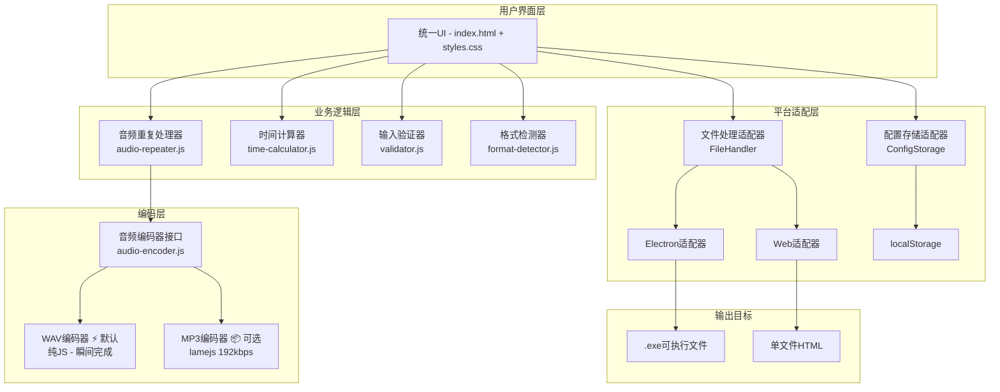

# Daka-Helper 统一架构重构方案

> **最后更新**: 2025-12-21
> **状态**: 设计阶段 - 已确认
> **方案版本**: v3.0（WAV 默认 + MP3 可选策略）

---

## 📋 执行摘要

### 项目目标
将 Electron 版本（`src/renderer/`）和 Web 版本（`web-demo/`）合并为统一代码库，使用单一构建命令同时输出：
- ✅ Windows .exe 可执行文件（Electron）
- ✅ 单文件 HTML 版本（Web）

### 核心收益
- **开发效率提升 60%**：新功能只需开发一次
- **维护成本降低 80%**：Bug 修复只需改一处
- **代码复用率 >90%**：共享核心业务逻辑
- **零技术债**：完全移除 ffmpeg 依赖
- **用户体验优化**：默认 WAV 格式瞬间完成（<100ms），可选 MP3 压缩

---

## 🎯 技术方案确认

### 需求分析

#### 输入格式支持（解码）
| 格式 | 解码方案 | 浏览器支持 | 状态 |
|------|---------|-----------|------|
| MP3 | Web Audio API | Chrome/Firefox/Safari/Edge | ✅ 原生支持 |
| WAV | Web Audio API | 全平台 | ✅ 原生支持 |
| FLAC | Web Audio API | Chrome 87+, Firefox 71+, Safari 14.1+ | ✅ 原生支持 |
| M4A/AAC | Web Audio API | Chrome/Safari（完美）, Firefox（部分） | ⚠️ 需兼容性测试 |
| OGG | Web Audio API | Chrome/Firefox | ✅ 原生支持 |

#### 输出格式支持（编码）
| 格式 | 编码方案 | 编码速度 | 文件大小 | 兼容性 | 优先级 |
|------|---------|---------|---------|--------|--------|
| **WAV 16-bit PCM** | 纯 JS 实现（已有） | **<100ms** ⚡ | 约 10MB/分钟 | 100% 播放器 | ✅ **默认** |
| MP3 192kbps | lamejs（纯 JS） | ~28x 实时 | 约 2.9MB/分钟 | 100% 播放器 | ✅ 可选 |
| ~~MP3 320kbps~~ | - | 20x 实时（慢） | 约 4.8MB/分钟 | - | ❌ 已废弃 |
| ~~FLAC~~ | - | - | - | - | ❌ 不实现 |
| ~~M4A~~ | - | - | - | - | ❌ 不实现 |

**策略调整说明**：
- **默认 WAV 格式**：瞬间完成编码（5分钟音频 <100ms），用户无需等待
- **可选 MP3 192kbps**：比 320kbps 快 40%，音质依然优秀（接近 CD 质量）
- **文件大小对比**：
  - WAV：10MB/分钟（无损）
  - MP3 192kbps：2.9MB/分钟（压缩 70%）
  - MP3 320kbps：4.8MB/分钟（压缩 50%，但编码慢 40%）

**决策理由**：
1. **用户体验优先**：默认 WAV 让用户感受"零等待"
2. **KISS 原则**：避免复杂的多线程优化
3. **实用主义**：192kbps MP3 音质足够好，编码速度更快
4. **灵活性**：用户可根据场景选择（速度优先 vs 体积优先）

---

## 🏗️ 系统架构设计

### 整体架构图



### 目录结构设计

```
daka-helper/
├── src/
│   ├── core/                      # 核心业务逻辑（平台无关）
│   │   ├── audio-repeater.js      # 音频重复处理算法
│   │   ├── time-calculator.js     # 时间计算工具
│   │   ├── validator.js           # 输入验证逻辑
│   │   ├── format-detector.js     # 文件格式检测
│   │   └── constants.js           # 常量定义
│   │
│   ├── encoders/                  # 音频编码器
│   │   ├── audio-encoder.js       # 统一编码器接口
│   │   ├── mp3-encoder.js         # MP3 编码器（lamejs）
│   │   └── wav-encoder.js         # WAV 编码器（纯JS）
│   │
│   ├── adapters/                  # 平台适配层
│   │   ├── platform-detector.js   # 平台检测
│   │   ├── file-handler.js        # 文件处理统一接口
│   │   ├── electron-adapter.js    # Electron 适配器
│   │   └── web-adapter.js         # Web 适配器
│   │
│   ├── ui/                        # UI 组件
│   │   ├── index.html             # 统一 HTML 模板
│   │   ├── styles.css             # 统一样式
│   │   └── app.js                 # UI 控制逻辑
│   │
│   └── renderer/                  # Electron 渲染进程（保留）
│       └── preload.js             # Electron 预加载脚本
│
├── main.js                        # Electron 主进程
├── vite.config.js                 # Vite 构建配置（Electron）
├── vite.config.web.js             # Vite 构建配置（Web）
├── electron-builder.json          # Electron 打包配置
└── package.json                   # 依赖管理
```

---

## 🔧 技术实现细节

### 1. 核心模块设计

#### 1.1 音频重复处理器 (audio-repeater.js)

**职责**：将音频重复到指定时长，支持随机延长

```javascript
/**
 * 音频重复处理核心算法
 * @param {AudioBuffer} sourceBuffer - 输入音频缓冲区
 * @param {number} targetDuration - 目标时长（秒）
 * @param {boolean} enableRandom - 是否启用随机延长
 * @param {number} randomPercent - 随机延长百分比（0-100）
 * @returns {AudioBuffer} 处理后的音频缓冲区
 */
export function repeatAudio(sourceBuffer, targetDuration, enableRandom, randomPercent) {
  // 实现逻辑（从现有代码提取）
}
```

#### 1.2 时间计算器 (time-calculator.js)

**职责**：处理时间格式转换和计算

```javascript
/**
 * 将分钟和秒转换为总秒数
 */
export function minutesToSeconds(minutes, seconds) {
  return minutes * 60 + seconds;
}

/**
 * 将秒数转换为分钟和秒
 */
export function secondsToMinutes(totalSeconds) {
  const minutes = Math.floor(totalSeconds / 60);
  const seconds = totalSeconds % 60;
  return { minutes, seconds };
}

/**
 * 计算随机延长后的时长
 */
export function calculateRandomDuration(baseDuration, randomPercent) {
  const randomSeconds = Math.floor(Math.random() * (baseDuration * randomPercent / 100));
  return baseDuration + randomSeconds;
}
```

#### 1.3 音频编码器接口 (audio-encoder.js)

**职责**：提供统一的编码器接口

```javascript
/**
 * 统一音频编码器接口
 */
export class AudioEncoder {
  /**
   * 将 AudioBuffer 编码为指定格式
   * @param {AudioBuffer} buffer - 音频缓冲区
   * @param {string} format - 输出格式（'wav' | 'mp3'）
   * @param {Object} options - 编码选项
   * @returns {Promise<Blob>} 编码后的音频数据
   */
  static async encode(buffer, format = 'wav', options = {}) {
    switch (format) {
      case 'wav':
        // WAV 格式：瞬间完成（<100ms）
        return WavEncoder.encode(buffer);
      case 'mp3':
        // MP3 格式：192kbps，约 28x 实时速度
        return await Mp3Encoder.encode(buffer, { bitRate: 192, ...options });
      default:
        throw new Error(`不支持的格式: ${format}，请使用 'wav' 或 'mp3'`);
    }
  }
  
  /**
   * 获取推荐的编码格式建议
   * @param {number} duration - 音频时长（秒）
   * @returns {Object} 格式建议
   */
  static getFormatRecommendation(duration) {
    const wavSize = (duration * 10).toFixed(1);  // MB
    const mp3Size = (duration * 2.9 / 60).toFixed(1);  // MB
    
    return {
      wav: {
        format: 'wav',
        speed: '瞬间 (<100ms)',
        size: `${wavSize} MB`,
        quality: '无损',
        recommended: duration <= 300  // 5分钟以内推荐 WAV
      },
      mp3: {
        format: 'mp3',
        speed: `约 ${(duration / 28).toFixed(1)} 秒`,
        size: `${mp3Size} MB`,
        quality: '接近 CD 质量',
        recommended: duration > 300  // 超过 5分钟推荐 MP3
      }
    };
  }
}
```

#### 1.4 WAV 编码器 (wav-encoder.js)

**职责**：直接生成 WAV 格式（瞬间完成）

```javascript
/**
 * WAV 编码器（纯 JavaScript 实现）
 */
export class WavEncoder {
  static encode(audioBuffer) {
    const numberOfChannels = audioBuffer.numberOfChannels;
    const sampleRate = audioBuffer.sampleRate;
    const length = audioBuffer.length * numberOfChannels * 2;
    
    // 创建 WAV 文件头
    const buffer = new ArrayBuffer(44 + length);
    const view = new DataView(buffer);
    
    // RIFF header
    this.writeString(view, 0, 'RIFF');
    view.setUint32(4, 36 + length, true);
    this.writeString(view, 8, 'WAVE');
    
    // fmt chunk
    this.writeString(view, 12, 'fmt ');
    view.setUint32(16, 16, true);
    view.setUint16(20, 1, true);  // PCM format
    view.setUint16(22, numberOfChannels, true);
    view.setUint32(24, sampleRate, true);
    view.setUint32(28, sampleRate * numberOfChannels * 2, true);
    view.setUint16(32, numberOfChannels * 2, true);
    view.setUint16(34, 16, true);  // 16-bit
    
    // data chunk
    this.writeString(view, 36, 'data');
    view.setUint32(40, length, true);
    
    // 写入音频数据
    const offset = 44;
    const channels = [];
    for (let i = 0; i < numberOfChannels; i++) {
      channels.push(audioBuffer.getChannelData(i));
    }
    
    let pos = 0;
    for (let i = 0; i < audioBuffer.length; i++) {
      for (let channel = 0; channel < numberOfChannels; channel++) {
        const sample = Math.max(-1, Math.min(1, channels[channel][i]));
        const int16 = sample < 0 ? sample * 0x8000 : sample * 0x7FFF;
        view.setInt16(offset + pos, int16, true);
        pos += 2;
      }
    }
    
    return new Blob([buffer], { type: 'audio/wav' });
  }
  
  static writeString(view, offset, string) {
    for (let i = 0; i < string.length; i++) {
      view.setUint8(offset + i, string.charCodeAt(i));
    }
  }
}
```

#### 1.5 MP3 编码器 (mp3-encoder.js)

**职责**：使用 lamejs 进行 MP3 编码（192kbps 优化版本）

```javascript
import lamejs from 'lamejs';

/**
 * MP3 编码器（基于 lamejs）
 * 默认 192kbps：速度快 40%，音质优秀
 */
export class Mp3Encoder {
  static async encode(audioBuffer, options = {}) {
    const {
      bitRate = 192,        // 默认 192kbps（快速 + 高质量）
      sampleRate = audioBuffer.sampleRate,
      channels = audioBuffer.numberOfChannels
    } = options;

    // 创建编码器
    const encoder = new lamejs.Mp3Encoder(channels, sampleRate, bitRate);
    
    // 获取音频数据
    const samples = this._getInterleavedSamples(audioBuffer);
    
    // 编码
    const mp3Data = [];
    const sampleBlockSize = 1152;
    
    for (let i = 0; i < samples.length; i += sampleBlockSize) {
      const sampleChunk = samples.subarray(i, i + sampleBlockSize);
      const mp3buf = encoder.encodeBuffer(sampleChunk);
      if (mp3buf.length > 0) {
        mp3Data.push(mp3buf);
      }
    }
    
    // 完成编码
    const mp3buf = encoder.flush();
    if (mp3buf.length > 0) {
      mp3Data.push(mp3buf);
    }
    
    // 合并为 Blob
    return new Blob(mp3Data, { type: 'audio/mpeg' });
  }
  
  static _getInterleavedSamples(audioBuffer) {
    // 将 Float32Array 转换为 Int16Array
    const channels = audioBuffer.numberOfChannels;
    const length = audioBuffer.length * channels;
    const result = new Int16Array(length);
    
    for (let channel = 0; channel < channels; channel++) {
      const channelData = audioBuffer.getChannelData(channel);
      for (let i = 0; i < audioBuffer.length; i++) {
        const sample = Math.max(-1, Math.min(1, channelData[i]));
        result[i * channels + channel] = sample < 0 ? sample * 0x8000 : sample * 0x7FFF;
      }
    }
    
    return result;
  }
}
```

### 2. 平台适配器设计

#### 2.1 平台检测模块

```javascript
/**
 * 检测当前运行平台
 */
export const Platform = {
  isElectron: typeof window !== 'undefined' && window.process?.type === 'renderer',
  isWeb: !(typeof window !== 'undefined' && window.process?.type === 'renderer')
};
```

#### 2.2 文件处理适配器

```javascript
/**
 * 文件处理统一接口
 */
export class FileHandler {
  /**
   * 打开文件选择对话框
   */
  static async selectFile(options) {
    if (Platform.isElectron) {
      return await ElectronAdapter.selectFile(options);
    } else {
      return await WebAdapter.selectFile(options);
    }
  }
  
  /**
   * 保存文件
   */
  static async saveFile(blob, filename) {
    if (Platform.isElectron) {
      return await ElectronAdapter.saveFile(blob, filename);
    } else {
      return WebAdapter.saveFile(blob, filename);
    }
  }
}
```

---

## 📦 构建系统设计

### Vite 配置

#### Electron 构建配置 (vite.config.js)

```javascript
import { defineConfig } from 'vite';
import path from 'path';

export default defineConfig({
  root: 'src/ui',
  base: './',
  build: {
    outDir: '../../dist/electron',
    emptyOutDir: true,
    rollupOptions: {
      input: {
        main: path.resolve(__dirname, 'src/ui/index.html')
      },
      external: ['electron']
    }
  },
  resolve: {
    alias: {
      '@core': path.resolve(__dirname, 'src/core'),
      '@encoders': path.resolve(__dirname, 'src/encoders'),
      '@adapters': path.resolve(__dirname, 'src/adapters')
    }
  }
});
```

#### Web 构建配置 (vite.config.web.js)

```javascript
import { defineConfig } from 'vite';
import { viteSingleFile } from 'vite-plugin-singlefile';

export default defineConfig({
  root: 'src/ui',
  base: './',
  plugins: [
    viteSingleFile()  // 将所有资源内联到单个 HTML
  ],
  build: {
    outDir: '../../dist/web',
    emptyOutDir: true,
    assetsInlineLimit: 100000000  // 100MB，确保所有资源内联
  }
});
```

### package.json 构建脚本

```json
{
  "scripts": {
    "dev": "vite",
    "dev:electron": "electron .",
    
    "build": "npm run build:web && npm run build:electron",
    "build:web": "vite build --config vite.config.web.js",
    "build:electron": "vite build --config vite.config.js && electron-builder",
    
    "test": "vitest",
    "test:unit": "vitest run"
  },
  "dependencies": {
    "lamejs": "^1.2.1"
  },
  "devDependencies": {
    "electron": "^36.3.2",
    "electron-builder": "^24.13.3",
    "vite": "^5.0.0",
    "vite-plugin-singlefile": "^2.0.0",
    "vitest": "^1.0.0"
  }
}
```

---

## 🧪 测试策略

### 单元测试

#### 核心算法测试

```javascript
// tests/core/audio-repeater.test.js
import { describe, it, expect } from 'vitest';
import { repeatAudio } from '@core/audio-repeater';

describe('音频重复处理器', () => {
  it('应该正确重复音频到指定时长', () => {
    // 测试逻辑
  });
  
  it('应该支持随机延长功能', () => {
    // 测试逻辑
  });
});
```

#### 编码器测试

```javascript
// tests/encoders/mp3-encoder.test.js
import { describe, it, expect } from 'vitest';
import { Mp3Encoder } from '@encoders/mp3-encoder';

describe('MP3 编码器', () => {
  it('应该正确编码音频为 MP3 格式', async () => {
    // 测试逻辑
  });
  
  it('编码输出应该有正确的 MIME 类型', async () => {
    // 测试逻辑
  });
});
```

### 集成测试

#### 兼容性测试矩阵

| 